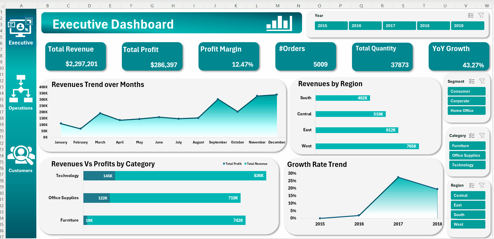
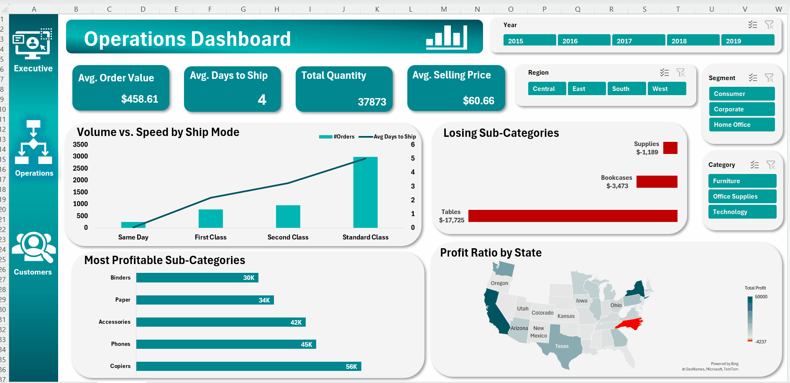
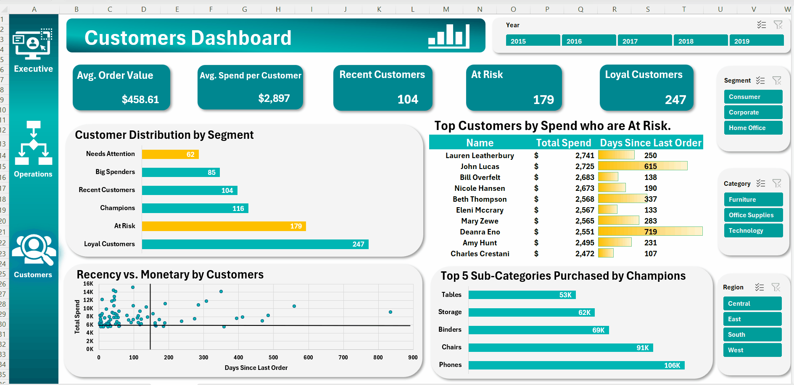
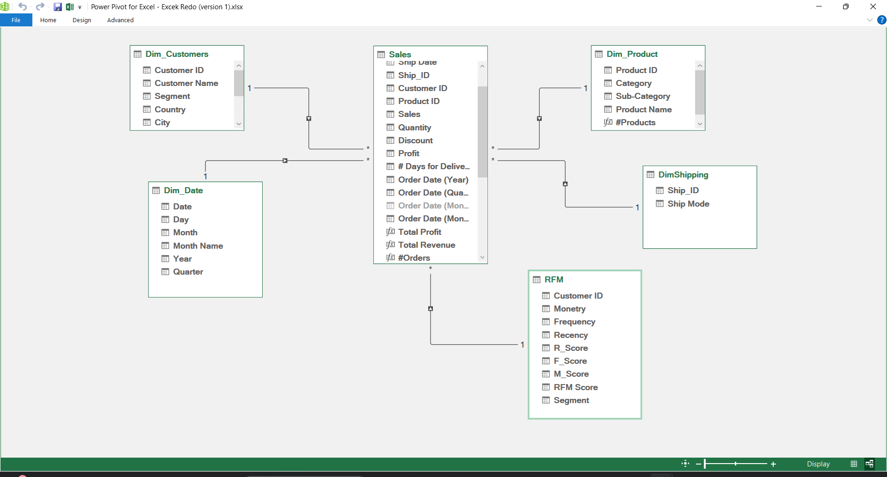

# Strategic Sales & RFM Dashboard 📊

### Executive Summary
This project is a Sales Intelligence Dashboard built to transform raw sales data into actionable business strategy. It utilizes a **Star Schema** data model and advanced visualization logic to drive decision-making for three key stakeholders: Executives, Operations, and Marketing.

---

### 🚀 Dashboard Showcase

#### 1. Executive View (Financial Health)
*Focus: Real-time financial health monitoring with Year-over-Year (YoY) growth acceleration metrics.*

#### 2. Operations View (Efficiency & Profit)
*Focus: Optimizing logistics and identifying "Profit Leaks" using diverging color logic.*

#### 3. Customer View (RFM & Retention)
*Focus: "Whale Hunting." identifying high-value customers at risk of churn using a custom Scatter Plot radar.*

---

### 🧠 The Strategy (V2.0 Logic)
I moved beyond standard reporting to build custom visual logic that answers specific business questions:

| Feature | The Strategic Logic |
| :--- | :--- |
| **Profit Analysis** | **Diverging Logic Map** (Red/Teal) instantly isolates unprofitable regions. |
| **Customer Churn** | **"Whale Radar" (Scatter Plot)** plots Recency vs. Lifetime Value to identify "Lost Whales" (High Spend, High Recency). |
| **Efficiency** | **Volume vs. Speed** combo chart identifies bottlenecks in shipping modes. |
| **UX Design** | **Strict Grid System** with an "F-Pattern" layout for optimal cognitive load management. |

---

### 🛠️ Technical Stack
* **Data Modeling:** Power Pivot (Star Schema) connecting Fact Tables (Sales) to Dimensions (Customers, Products, Locations).
* **ETL:** Power Query used for data cleaning and transformation.
* **DAX:** Custom measures for `Churn Risk`, `Average Shipping Days`, and `Active Customer Count`.
* **Visual Engineering:** Conditional formatting, custom number formats, and non-standard chart types.

#### Backend Data Model
*The dashboard is powered by a robust Star Schema ensuring data integrity and query performance.*

---

### 🔄 Data Source
* **Dataset:** Superstore Sales Data (2015-2018).
* **Volume:** ~10,000 Records.

*Author: Saleh Hossam*
